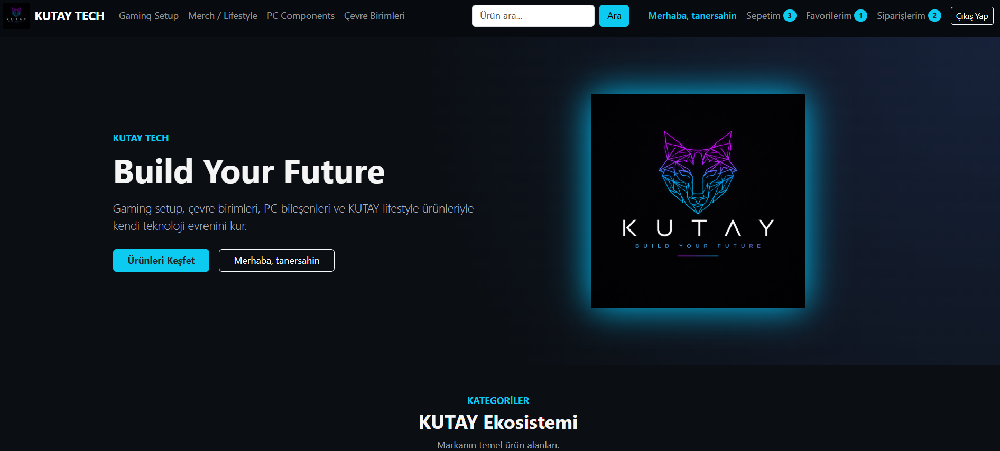
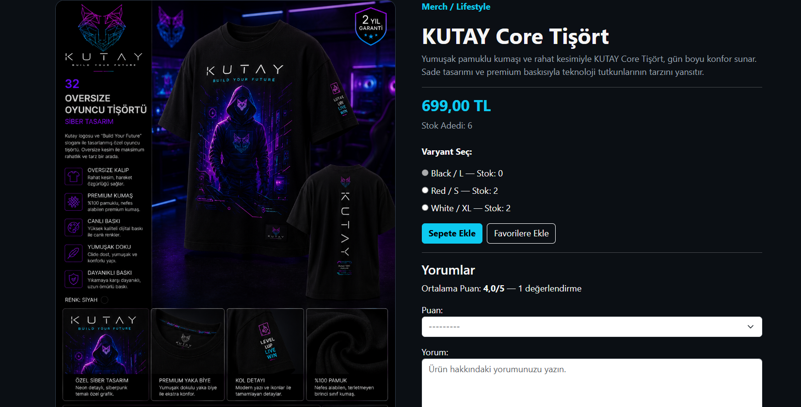
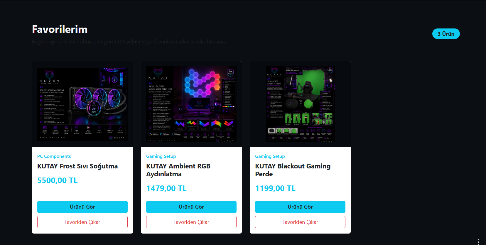
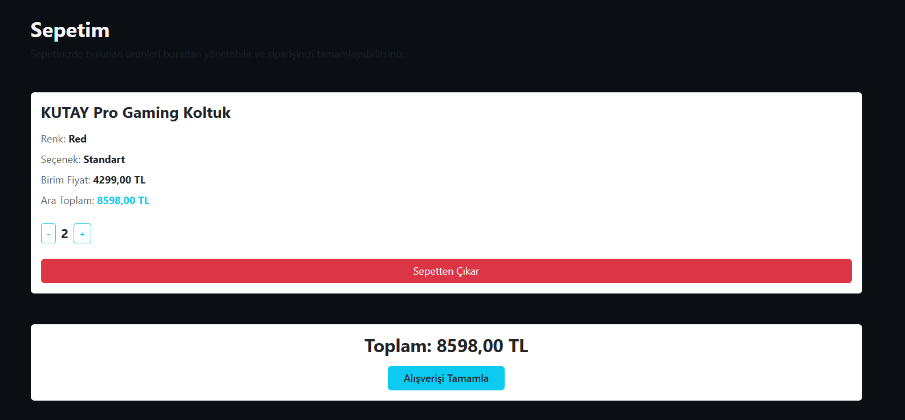
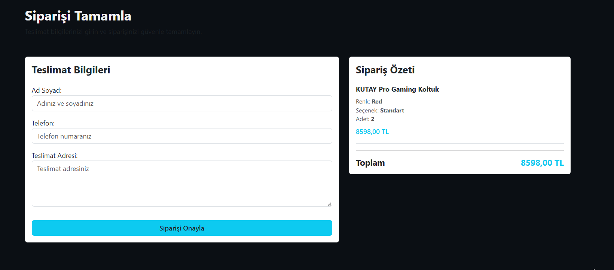
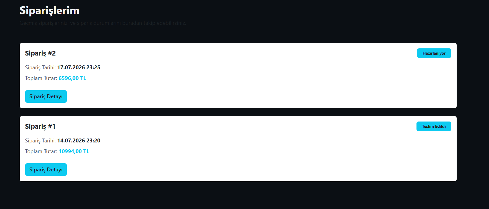
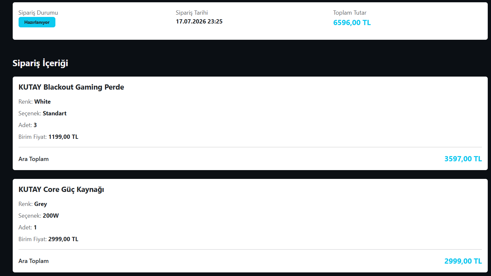
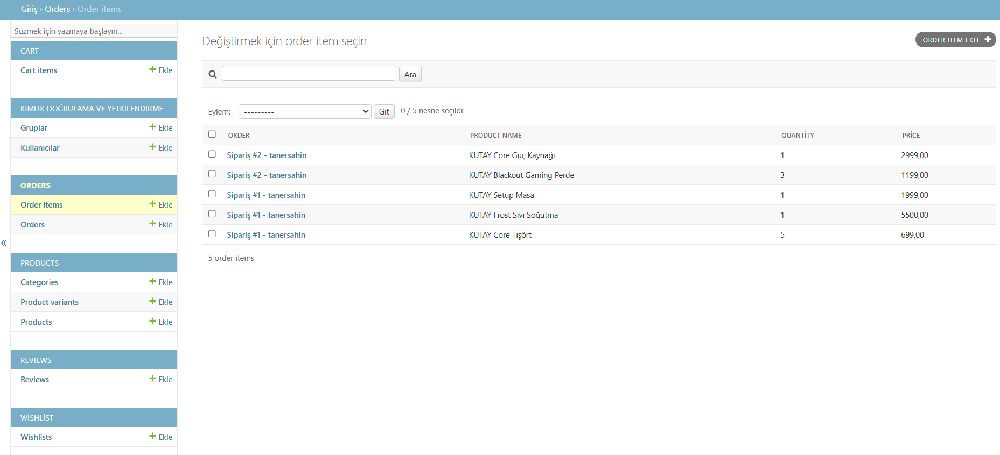

# 🚀 KUTAY-TECH

**Backend-focused e-commerce platform built with Django, featuring Product Variants, Wishlist, Shopping Cart, Order Management, Review System, Search functionality, and a production-ready architecture prepared for PostgreSQL, Gunicorn, Nginx, and Ubuntu deployment.**

---

# 📖 About The Project

KUTAY-TECH is a backend-focused e-commerce platform developed with Django to simulate a real-world online shopping system.

The primary goal of this project is not only to build an online store, but also to understand how professional backend systems are designed, how business logic is implemented, and how production-ready Django applications are deployed.

The project focuses on clean architecture, scalable database design, user authentication, product management, shopping cart logic, order workflows, stock management, and deployment preparation.

---

# ✨ Features

## 👤 Authentication

- User Registration
- User Login
- User Logout
- Protected Pages
- Session Management

---

## 📦 Product Management

- Dynamic Categories
- Product Detail Pages
- Product Images
- Product Search
- Product Variants
- Variant Selection
- Slug-Based URLs

---

## 🎨 Product Variant System

- Color Variants
- Size / Option Variants
- Variant-Based Stock
- Separate Stock Per Variant
- Prevent Invalid Variant Selection

---

## ❤️ Wishlist

- Add To Wishlist
- Remove From Wishlist
- User Based Wishlist
- Wishlist Counter

---

## 🛒 Shopping Cart

- Add To Cart
- Remove From Cart
- Increase Quantity
- Decrease Quantity
- Variant-Based Cart
- Stock Limit Control
- Automatic Cart Total

---

## 📋 Checkout & Orders

- Checkout Form
- Order Creation
- Order History
- Order Detail
- Order Status
- Order Snapshot Logic
- Variant-Based Stock Reduction

---

## ⭐ Review System

- Product Reviews
- Rating System
- One Review Per User
- Average Rating Calculation

---

## 🔍 Search

- Product Search
- Keyword Filtering

---

## 🛡 Security

- Login Required Views
- CSRF Protection
- Environment Variables (.env)
- Production Settings Ready

---

# 🏗 Project Architecture

```text
Category
     │
     ▼
Product
     │
     ▼
ProductVariant
     │
     ▼
CartItem
     │
     ▼
Order
     │
     ▼
OrderItem
```

This architecture allows every product variant to maintain its own stock quantity while enabling realistic shopping cart and order workflows similar to modern e-commerce platforms.

---

# ⚙ Technologies

## Backend

- Python
- Django

## Database

- SQLite (Development)
- PostgreSQL (Production Ready)

## Frontend

- HTML5
- CSS3
- Bootstrap 5

## Deployment

- Ubuntu Server
- Gunicorn
- Nginx
- WhiteNoise
- SSL Ready

## Tools

- Git
- GitHub
- VS Code

---

# 📸 Screenshots

## 🏠 Home Page



---

## 📦 Product Detail



---

## ❤️ Wishlist



---

## 🛒 Shopping Cart



---

## 💳 Checkout



---

## 📋 My Orders



---

## 📄 Order Detail



---

## ⚙ Django Admin



---

# 📚 What I Learned

During this project I gained practical experience with:

- Django Project Structure
- Django ORM
- Models
- Views
- URL Routing
- Templates
- Forms
- Context Processors
- Authentication System
- Session Management
- ForeignKey Relationships
- Product Variant Architecture
- Shopping Cart Logic
- Wishlist Logic
- Checkout Workflow
- Order Management
- Order Snapshot Logic
- Review System
- Stock Management
- Search Functionality
- Query Optimization
- Git Workflow
- GitHub Workflow
- Environment Variables
- WhiteNoise
- PostgreSQL Preparation
- Production Settings
- Ubuntu Deployment Preparation

---

# 🚀 Project Status

✅ Authentication System

✅ Product Management

✅ Product Variant System

✅ Wishlist System

✅ Shopping Cart

✅ Checkout System

✅ Order Management

✅ Review System

✅ Search System

✅ Stock Control

✅ Production Configuration

✅ PostgreSQL Ready

✅ WhiteNoise Ready

✅ Ubuntu Deployment Ready

---

# 🎯 Project Goal

The goal of this project is to build a production-ready Django backend application while learning professional software development practices, scalable architecture, Linux server management, PostgreSQL administration, Gunicorn application serving, Nginx configuration, and real-world deployment workflows.

---

# 👨‍💻 About Me

## Taner Şahin

Backend-focused Django Developer passionate about building scalable web applications and continuously improving backend development skills.

Currently focused on:

- Python
- Django
- PostgreSQL
- Linux
- Gunicorn
- Nginx
- Git
- GitHub

---

# 📬 Contact

GitHub

https://github.com/taner-sahin

---

# ⭐ Thank You

Thank you for visiting this repository.

This project represents an important milestone in my journey toward becoming a professional Django Backend Developer.

Every feature in this project was developed as part of a hands-on learning process focused on understanding real-world backend architecture and software engineering principles.